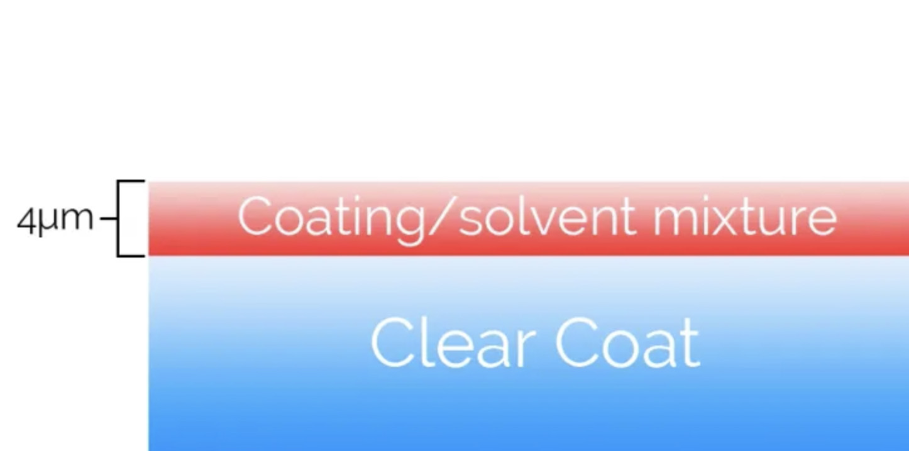
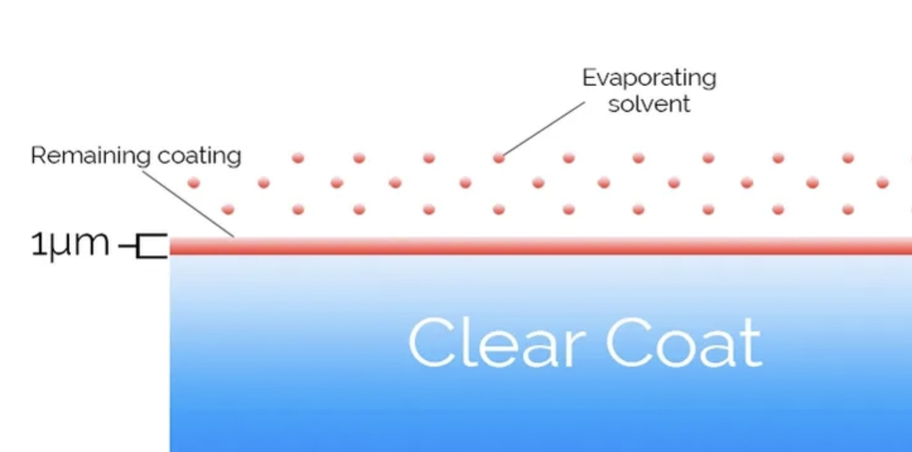
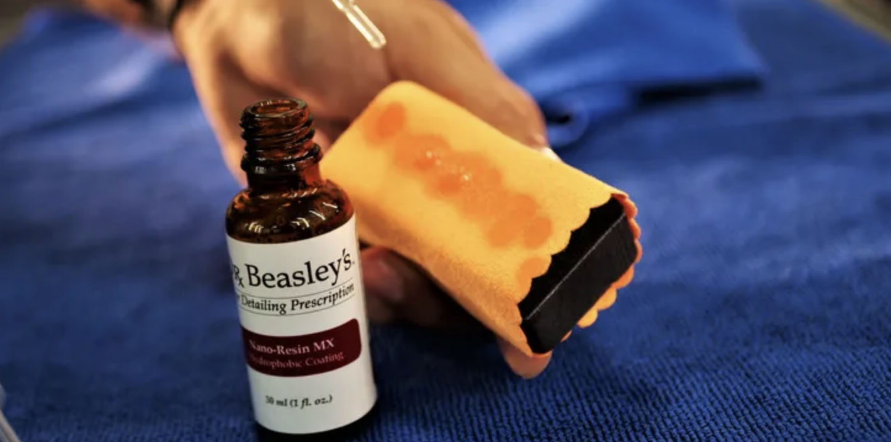
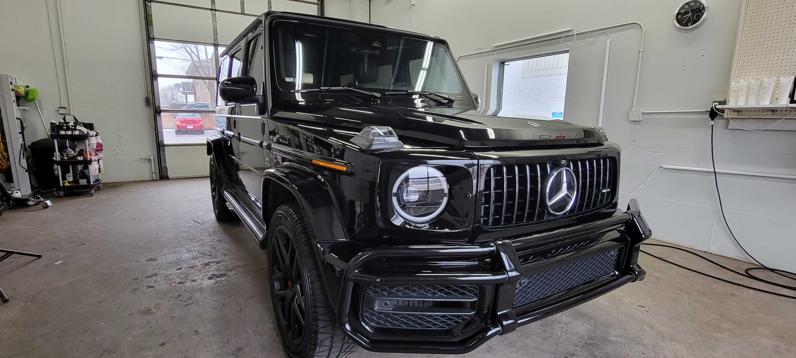

---
hide:
  - navigation
  - toc
---

# Top-Tier Ceramic Coatings

We are an authorized detailer for **Dr. Beasley's** and use their premium ceramic formulations. [Learn more about us](../../who-we-are.md).

## About Ceramic Coatings

Ceramic Coatings are the highest grade of protection & gloss enhancement for your vehicle. Unlike traditional waxes & sealants which are just films that sit on the surface of a vehicle, true ceramic coatings create a semi-permanent barrier of protection that bonds with your vehicle's surface providing unmatched durability, protection, gloss, & self-cleaning abilities.

## Ceramic Pretenders

The vast majority of "ceramic" coatings available are ceramic in the loosest sense of the word. These ceramic coatings on the market have a high content of carrying solvents to evenly distribute the small amounts of ceramic resin. The only ceramic found in these products are suspended within the solvents and don't make up the nano structure.

## Closer But No Ceramic

When solvents evaporate you're left with a small amount of ceramic protection. That's why most coatings on the market require multi-layer systems to achieve any type of legitimate measurable protection. Many detailers tout multilayer systems, but at the end of the day, more layers raise service cost, increase margin of error, and still do not offer optimal protection.

## Authentic Formulas

Our Premium Ceramic Coating Offerings from Dr. Beasley's provide a line of 100% SiO2 & TiO2 solid formulas, providing the thickest and longest-lasting ceramic coatings on the market. When we combine our coating offerings with the advanced technology of our [NSP Paint Correction Technology](https://www.youtube.com/watch?v=_17Ixz_pCJU), we also out-gloss the competition.

## What's the Difference Between Ceramic Coating Manufacturers?

You've probably already realized that hundreds of ceramic coating options are available from multiple ceramic coating manufacturers. So consumers' main questions are:

### What's the Difference Between Coating Manufacturers & Brands?

Think about the coating industry just like any other; a few companies develop their products from the ground up, while others go directly to an already existing blender (chemical manufacturer) and rebrand an already existing product. Sadly this means that most coating options on the market are a "copy and paste" developed for maximum profitability, not gloss and protection. At Speckless Auto Spa, we work with Dr. Beasley's & Modesta, who formulate and manufacture their small-batch coating technology in-house from the ground up.

### Why Are Ceramic Coating Services So Expensive?

To answer that question, we have to look at the research and development that goes into ceramic coatings. Surface Protection Technology for ceramic coatings takes years to complete because if a ceramic coating lasts 5 years, the manufacturer must perform real-world testing to gain sufficient proof of results. After working with major manufacturers and chemists in the industry, it takes 3 to 5 years and over $100,000 to develop a single new coating product, let alone produce it. Combined with the actual manufacture/material cost of making a product like our most advanced coatings, Dr. Beasley's [Nano Resin Pro and Modesta Private Label](https://www.youtube.com/watch?v=QYVxlhrqenQ), a single bottle costs upwards of $500 per ounce. Not only are the products expensive, but the amount of time it takes to properly prepare a vehicle for a coating application can range from 4 hours to 40 hours of extensive paint correction by trained and certified detailing technicians.

### What Ceramic Coating Should I Get?

The answer to this question depends on you and your needs as the vehicle owner. Our trained customer service representatives take you step by step in deciding what coating and paint correction service is best for you. It takes multiple person-hours and hundreds of dollars in product cost for our trained team of detailers to properly paint correct and install a coating, so there is no point in selling you services you don't need. We get plenty of customers asking about our lifetime coatings, only to realize they need 3 years of protection because they will likely trade in their vehicle soon. We respect your time and money just as much as ours, and that's why our over-the-phone consultations are paired with our in-person vehicle inspection for all of our advanced correction and coating services.

## Your Car's Finish Is Fading Right Now

The phone you're reading this on probably has a phone case for protection—why doesn't the second largest investment in your life have one?

